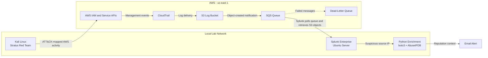

# Hybrid AWS Detection Engineering Lab

An end-to-end cloud detection engineering lab that generates ATT&CK-mapped activity in AWS, ingests CloudTrail logs into a self-hosted Splunk instance, detects suspicious behavior with Sigma-derived SPL, and enriches source IPs with AbuseIPDB reputation data.

**Stack:** AWS CloudTrail · S3 · SQS · Terraform · Splunk Enterprise · Splunk Add-on for AWS · Stratus Red Team · Sigma · sigma-cli · Python · boto3 · AbuseIPDB · Kali Linux

**Full technical write-up:** [Hybrid_Threat_Detection_Writeup.pdf](Hybrid_Threat_Detection_Writeup.pdf)

---

## Project Goals

This project extends my earlier Windows and endpoint-focused labs into cloud detection engineering. The goals were to:

- provision AWS logging infrastructure with Terraform;
- generate realistic AWS activity with Stratus Red Team;
- ingest raw CloudTrail events into Splunk through S3 and SQS;
- engineer and tune detections for multiple attack patterns;
- enrich alerts with external IP reputation data; and
- document the full workflow in a reproducible lab environment.

---

## Architecture

CloudTrail records configured AWS management activity and delivers the logs to S3. S3 sends object-created notifications to SQS, and the Splunk Add-on for AWS polls the queue and retrieves the corresponding log objects. The dead-letter queue preserves messages that repeatedly fail processing so ingestion problems can be investigated instead of silently ignored.

---

## Workflow

### 1. Infrastructure as Code

Terraform provisions the AWS logging pipeline, including:

- a multi-region CloudTrail trail;
- an S3 bucket for CloudTrail log delivery;
- an SQS queue for S3 event notifications;
- a dead-letter queue;
- a redrive policy; and
- the IAM permissions required for log delivery and ingestion.

The environment can be created with `terraform apply` and removed with `terraform destroy`, which keeps the lab reproducible and limits unnecessary cloud cost.

### 2. CloudTrail Ingestion into Splunk

Splunk runs on an Ubuntu server in the local lab. The Splunk Add-on for AWS consumes the SQS notifications, retrieves the corresponding CloudTrail objects from S3, and indexes the events for investigation and detection.

Amazon GuardDuty was intentionally excluded to keep the lab within a zero-cost budget after the trial period. Instead, the project focuses on engineering detections directly against raw CloudTrail data in Splunk.

### 3. Adversary Emulation

Stratus Red Team was used from Kali Linux to generate five ATT&CK-mapped AWS behaviors. Each technique was executed, verified in CloudTrail, detected in Splunk, and cleaned up after testing.

| Behavior | ATT&CK | Detection objective |
|---|---|---|
| Console login without MFA | T1078.004 | Identify successful console access without MFA |
| Cloud infrastructure enumeration | T1580 / T1087 | Detect a burst of discovery calls from one identity |
| Create an IAM administrator user | T1136.003 | Correlate user creation with administrative policy attachment |
| Bulk secrets retrieval | T1555 / T1552 | Detect repeated Secrets Manager retrieval from one identity |
| Stop CloudTrail logging | T1562.008 | Alert when logging is disabled |

<strong>View detection evidence for all five techniques</strong>

 

**T1078.004 — Console login without MFA**

**T1580 / T1087 — Cloud infrastructure enumeration**

**T1136.003 — IAM administrator user creation**

**T1555 / T1552 — Bulk secrets retrieval**

**T1562.008 — Stop CloudTrail logging**

### 4. Detection Engineering

The base detection logic was written in Sigma and converted to Splunk SPL with `sigma-cli`. Sigma provided a portable starting point, while the resulting SPL was validated and tuned against the actual CloudTrail field structure in this environment.

The five detections intentionally use different detection patterns:

| Detection | Pattern | Tuning approach |
|---|---|---|
| Console login without MFA | Single-event condition | Treat successful no-MFA login as a security finding |
| Enumeration burst | Volume and event-variety threshold | Exclude AWS service roles and allowlist approved inventory tooling |
| IAM administrator user creation | Multi-event correlation | Require user creation and administrative policy attachment within a short window |
| Bulk secrets retrieval | Per-identity rate threshold | Allowlist approved application and CI/CD identities |
| Stop CloudTrail logging | Critical single-event alert | Validate planned maintenance through change control |

#### Detection Engineering Lessons

**Service-role noise:** AWS-managed service roles continuously perform `List*` and `Describe*` actions. Filtering assumed-role ARNs containing `AWSServiceRoleFor` removed false positives from the enumeration rule.

**Legitimate credential misuse:** Several techniques were executed under a valid administrative identity. Because a compromised administrator still appears to be an administrator, the detections focus on suspicious behavior, sequence, and volume rather than relying only on identity reputation.

### 5. IP Reputation Enrichment

A Python script uses `boto3` and `requests` to extract source IPs from CloudTrail activity, query AbuseIPDB, and attach reputation context to an alert. This reduces the amount of manual triage required after a suspicious event is detected.

---

## Key Findings

- **Time normalization matters.** Stratus output used local time while CloudTrail events were recorded in UTC. Normalizing timestamps was necessary to correlate activity correctly.
- **Behavior is often more useful than identity.** Cloud attacks frequently use valid credentials, so identity alone is not a reliable indicator of legitimacy.
- **Queues improve ingestion resilience.** SQS decouples S3 log delivery from Splunk availability, while the dead-letter queue exposes repeated processing failures.
- **Portable rules still require backend validation.** Sigma accelerates rule development, but field mappings, thresholds, and correlation behavior must be tested in the target SIEM.
- **Cost constraints can improve design clarity.** Excluding GuardDuty kept the environment inexpensive and made the custom detection logic visible instead of relying on a managed finding.

---

## Limitations

- This is a controlled lab, so the detections were tested against a smaller identity and event volume than a production AWS environment.
- Thresholds and allowlists would need to be baselined separately for each organization.
- AbuseIPDB enrichment depends on the reputation data available for a source IP and should be treated as context, not proof of malicious activity.
- The project focuses on CloudTrail management events rather than every possible AWS telemetry source.

---

## What This Project Demonstrates

- AWS security logging and cloud telemetry analysis;
- infrastructure as code with Terraform;
- S3/SQS-based log ingestion into Splunk;
- adversary emulation with Stratus Red Team;
- ATT&CK-mapped detection engineering;
- Sigma-to-SPL conversion and validation;
- false-positive reduction and behavioral tuning;
- Python-based threat intelligence enrichment; and
- clear technical documentation of an end-to-end detection workflow.

## What This Demonstrates

End-to-end cloud detection engineering: infrastructure as code, a resilient ingestion pipeline, ATT&CK emulation with production tooling, portable detections with real false-positive tuning, and automated enrichment. Built to reflect how a modern SOC actually operates: hybrid, log-driven, and detection-engineering-led.
